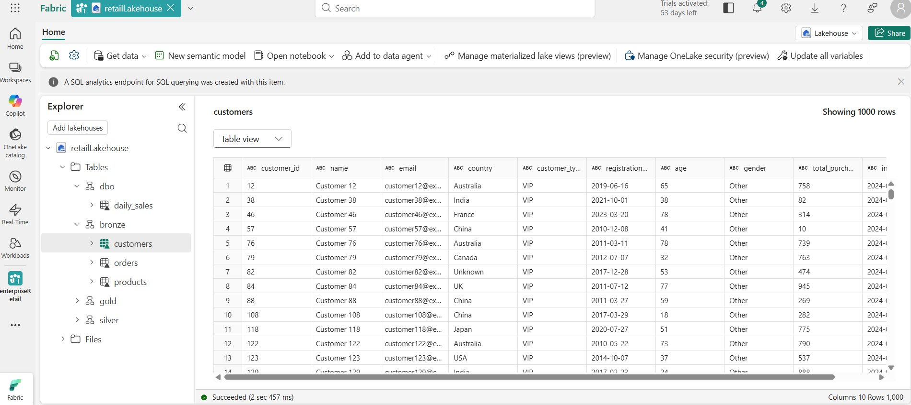

# 🏪 Enterprise Retail — Microsoft Fabric Data Lakehouse

> A scalable, end-to-end data lakehouse solution built on **Microsoft Fabric** to unify retail data across 27 countries, 11,000+ stores, and a high-volume e-commerce platform.

---

## 📌 Project Overview

Enterprise Retail is a multinational retailer generating enormous volumes of transactional and customer data daily. This project implements a **Microsoft Fabric Data Lakehouse** to consolidate both in-store and online channel data, enabling real-time analytics, accurate forecasting, and improved customer personalization — all at enterprise scale.

---

## 💼 Business Need

Enterprise Retail requires a solution that can:

- ✅ Consolidate data from **in-store and online channels** across multiple countries
- ✅ Process vast amounts of **historical and real-time transactional data**
- ✅ Enable **accurate, company-wide analytics** to drive better decision-making
- ✅ **Scale** to meet future growth and potential acquisitions

---
## 📁 Project Structure

```
enterprise-retail-fabric/
│
├── pipelines/
│   ├── ingest_customers_data.csv
│   ├── ingest_products_data.json
│   └── ingest_orders_data.parquet
│
├── notebooks/
│   ├── silver_customers_load.ipynb
│   ├── silver_products_load.ipynb
│   ├── silver_orders_load.ipynb
│   ├── gold_daily_sales.ipynb
│   └── gold_daily_sales_by_category.ipynb
│
├── semantic_model/
│   └── retailSemantic.bim
│
├── reports/
│   └── retail_report.pbix
│
└── README.md
```

## 🗄️ Data Sources

| Source | Format | Volume | Frequency |
|---|---|---|---|
| Customer Data (CRM) | CSV | 500 million records | Daily |
| Product Catalog (Inventory) | JSON | 1 million SKUs | On update |
| Transaction History (POS + e-commerce) | Parquet | 10 billion transactions/year | Daily |

---

## 🏗️ Architecture

The solution follows a **Medallion (Bronze → Silver → Gold)** lakehouse architecture within Microsoft Fabric:

```
                        ┌─────────────────────────────────────────────┐
                        │              Microsoft Fabric                │
                        │                                             │
  ┌──────────┐          │  ┌──────────┐   ┌──────────┐   ┌────────┐  │
  │ CRM CSV  │──────────┼─▶│  BRONZE  │──▶│  SILVER  │──▶│  GOLD  │  │
  │ Inv JSON │──────────┼─▶│  (Raw)   │   │ (Cleaned)│   │(Models)│  │
  │ POS PAR  │──────────┼─▶│          │   │          │   │        │  │
  └──────────┘          │  └──────────┘   └──────────┘   └────┬───┘  │
                        │                                      │      │
                        └──────────────────────────────────────┼──────┘
                                                               │
                                                    ┌──────────▼──────────┐
                                                    │       Power BI       │
                                                    │  Real-Time Dashboards│
                                                    └─────────────────────┘
```

---

## 🔧 Solution Approach

### 1. 🟫 Bronze Layer — Data Ingestion

- Automated daily ingestion of **CSV, JSON, and Parquet** files into the Lakehouse Bronze Layer
- **Fabric Pipelines** orchestrate and automate all ingestion processes
- Raw data is stored as-is to preserve source fidelity

### 2. 🥈 Silver Layer — Data Processing & Cleansing

Three dedicated PySpark notebooks handle incremental loads from the Bronze layer, each applying domain-specific transformation rules before upserting into Delta tables via `MERGE`.

#### 📓 `silver_Customer_load`

Transforms raw customer records into `silver_customers` with the following rules:

- **Email validation** — filters out records with null email values
- **Age validation** — retains only customers aged 18–100
- **Customer segmentation** — derives `customer_segment` as `High Value` (purchases > 10,000), `Medium Value` (> 5,000), or `Low Value` (≤ 5,000)
- **Days since registration** — calculates `days_since_registration` using `DATEDIFF` from `registration_date` to current date
- **Junk record removal** — excludes any records with negative `total_purchases`

#### 📓 `silver_product_load`

Transforms raw product records into `silver_products` with the following rules:

- **Price normalization** — converts negative prices to `0`
- **Stock quantity normalization** — converts negative stock quantities to `0`
- **Rating normalization** — clamps `rating` between `0` and `5`
- **Price categorization** — derives `price_category` as `Premium` (> 1,000), `Standard` (> 100), or `Budget` (≤ 100)
- **Stock status** — derives `stock_status` as `Out of Stock` (0), `Low Stock` (< 10), `Moderate Stock` (< 50), or `Sufficient Stock` (≥ 50)
- **Null filtering** — removes records where `name` or `category` is null

#### 📓 `silver_orders_load`

Transforms raw order/transaction records into `silver_orders` with the following rules:

- **Quantity & amount normalization** — converts negative `quantity` or `total_amount` to `0`
- **Date casting** — ensures `transaction_date` is consistently cast to `DATE` type
- **Order status derivation** — derives `order_status` as `Cancelled` (qty = 0 and amount = 0), `Completed` (qty > 0 and amount > 0), or `In Progress` (all other cases)
- **Data quality filtering** — removes records with null `transaction_date`, `customer_id`, or `product_id`

All three notebooks use an **incremental load pattern** — tracking `MAX(last_updated)` to process only new or changed records — and **Delta Lake MERGE** to upsert into the Silver tables, supporting both inserts and updates.

### 3. 🥇 Gold Layer — Data Modeling

Three PySpark notebooks aggregate the cleaned Silver layer data into business-ready Gold tables, each using `CREATE OR REPLACE TABLE` for full refresh on each run.

#### 📓 `gold_daily_sales`

Creates `gold.daily_sales` by aggregating `silver.orders` to produce a daily revenue summary:

- **Aggregation** — groups all transactions by `transaction_date` and sums `total_amount` into `daily_total_sales`
- **Output** — one row per day, enabling day-over-day sales trend analysis in Power BI

#### 📓 `gold_monthly_sales`

Creates `gold.monthly_sales` by rolling daily transactions up to month-level granularity:

- **Date truncation** — uses `DATE_TRUNC('month', ...)` to normalize all dates to the first of each month as `sales_month`
- **Aggregation** — sums `total_amount` into `monthly_total_sales` per month
- **Output** — one row per month ordered chronologically, powering the Monthly Sales Trend chart in the Power BI report

#### 📓 `gold_daily_sales_by_category`

Creates `gold.category_sales` by joining orders with products to produce category-level revenue:

- **Cross-table join** — joins `silver.orders` and `silver.products` on `product_id` to enrich orders with `category`
- **Aggregation** — groups by `product_category` and sums `total_amount` into `category_total_sales`
- **Output** — one row per product category (Clothing, Sports, Toys, Garden, Automotive, Home, Food, Books, Electronics, Beauty), powering the Category Sales Distribution pie chart in Power BI

All three Gold tables feed directly into the `retailSemantic` model, where calculated measures such as **Avg Monthly Sales** and **Best Category Sales** are defined for dashboard consumption.

### 4. ⚡ Batch Processing

- Efficient **Apache Spark jobs** within Fabric's Spark Engine handle daily incremental loads
- Jobs designed for high throughput and parallelism to meet the sub-6-hour SLA

### 5. 📊 Analytics & Reporting

- **Power BI** connected directly to Microsoft Fabric for real-time dashboards
- Separate reporting views for Sales, Finance, Inventory, and Marketing teams

---

## 📸 Screenshots

### Lakehouse — Customers Table (Bronze Layer)
> Raw customer data ingested into the Bronze layer of the `retailLakehouse`, showing 1,000 rows with fields including `customer_id`, `name`, `country`, `customer_type`, `age`, `gender`, and `total_purchases`.



---

### Semantic Model — retailSemantic
> The Gold layer semantic model (`retailSemantic`) showing three core tables: `category_sales`, `daily_sales`, and `monthly_sales`, each with calculated measures and dimensions ready for Power BI consumption.


---

### Power BI Report — Enterprise Retail Report
> The `enterpriseRetailReport` Power BI dashboard displaying key KPIs — **$4.66M Total Sales**, **$97.15K Avg Monthly Sales**, and **$519.24K Best Category Sale** — alongside Sales by Product Category, Category Sales Distribution (pie chart), and a Monthly Sales Trend over 4 years.


---

## 🎯 Expected Outcomes

| Metric | Before | After |
|---|---|---|
| Data Processing Time | 72 hours | < 6 hours |
| Inventory Forecasting Accuracy | Baseline | +25% improvement |
| Repeat Purchase Rate | Baseline | +15% increase |
| Financial Reporting | Delayed / regional | Real-time / global |

---

## 🚧 Challenges Addressed

| Challenge | Mitigation |
|---|---|
| Poor data quality in older and acquired records | Fabric Dataflows with cleansing and validation rules |
| Varying schemas and formats across regions | Delta Lake schema evolution + transformation pipelines |
| 5 years of historical data + daily updates | Incremental load strategy with Spark batch jobs |
| Currency, time zone, and regional code differences | Fabric Transformation Activities for normalization |
| Minimizing operational disruption | Phased rollout with parallel run strategy |

---

## 🛠️ Tech Stack

| Component | Technology |
|---|---|
| Data Platform | Microsoft Fabric |
| Storage | OneLake (Delta Lake format) |
| Ingestion | Fabric Pipelines |
| Transformation | Fabric Dataflows Gen2, Spark |
| Data Modeling | Fabric Semantic Model (Power BI Dataset) |
| Reporting | Power BI |
| File Formats | CSV, JSON, Parquet |
| Transaction Support | Delta Lake (ACID) |

---

## 🚀 Getting Started

### Prerequisites

- Microsoft Fabric workspace with Lakehouse enabled
- Contributor or Admin role in the Fabric workspace
- Source data access (CRM, Inventory, POS/e-commerce exports)

### Setup Steps

1. **Create a Lakehouse** in your Microsoft Fabric workspace named `retailLakehouse`
2. **Configure Bronze Layer** tables: `customers`, `orders`, `products`
3. **Set up Fabric Pipelines** for automated daily ingestion from source systems
4. **Create Dataflows** in the Silver layer for cleansing and normalization
5. **Build Gold layer models** using the Fabric Semantic Model editor
6. **Connect Power BI** to the semantic model and publish dashboards


*Built with ❤️ using Microsoft Fabric — Unifying retail data at enterprise scale.*
