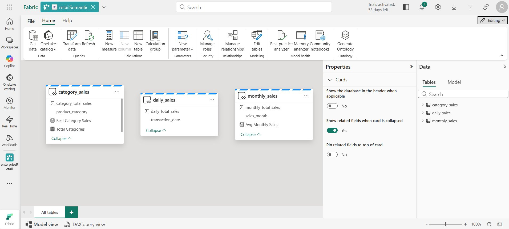
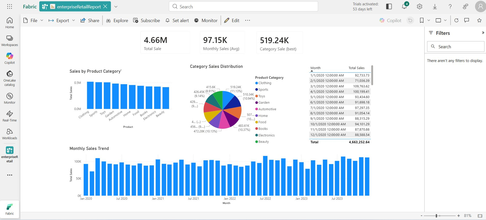

# 🏪 Enterprise Retail — Microsoft Fabric Data Lakehouse

> A scalable, end-to-end data lakehouse solution built on **Microsoft Fabric** to unify retail data across 27 countries, 11,000+ stores, and a high-volume e-commerce platform.

---

## 📋 Table of Contents

- [Project Overview](#project-overview)
- [Business Need](#business-need)
- [Data Sources](#data-sources)
- [Architecture](#architecture)
- [Solution Approach](#solution-approach)
- [Screenshots](#screenshots)
- [Expected Outcomes](#expected-outcomes)
- [Challenges Addressed](#challenges-addressed)
- [Tech Stack](#tech-stack)
- [Getting Started](#getting-started)
- [Project Structure](#project-structure)
- [Contributing](#contributing)

---

## 📌 Project Overview

Enterprise Retail is a multinational retailer generating enormous volumes of transactional and customer data daily. This project implements a **Microsoft Fabric Data Lakehouse** to consolidate both in-store and online channel data, enabling real-time analytics, accurate forecasting, and improved customer personalization — all at enterprise scale.

---

## 💼 Business Need

Enterprise Retail requires a solution that can:

- ✅ Consolidate data from **in-store and online channels** across multiple countries
- ✅ Process vast amounts of **historical and real-time transactional data**
- ✅ Enable **accurate, company-wide analytics** to drive better decision-making
- ✅ **Scale** to meet future growth and potential acquisitions

---

## 🗄️ Data Sources

| Source | Format | Volume | Frequency |
|---|---|---|---|
| Customer Data (CRM) | CSV | 500 million records | Daily |
| Product Catalog (Inventory) | JSON | 1 million SKUs | On update |
| Transaction History (POS + e-commerce) | Parquet | 10 billion transactions/year | Daily |

---

## 🏗️ Architecture

The solution follows a **Medallion (Bronze → Silver → Gold)** lakehouse architecture within Microsoft Fabric:

```
                        ┌─────────────────────────────────────────────┐
                        │              Microsoft Fabric                │
                        │                                             │
  ┌──────────┐          │  ┌──────────┐   ┌──────────┐   ┌────────┐  │
  │ CRM CSV  │──────────┼─▶│  BRONZE  │──▶│  SILVER  │──▶│  GOLD  │  │
  │ Inv JSON │──────────┼─▶│  (Raw)   │   │ (Cleaned)│   │(Models)│  │
  │ POS PAR  │──────────┼─▶│          │   │          │   │        │  │
  └──────────┘          │  └──────────┘   └──────────┘   └────┬───┘  │
                        │                                      │      │
                        └──────────────────────────────────────┼──────┘
                                                               │
                                                    ┌──────────▼──────────┐
                                                    │       Power BI       │
                                                    │  Real-Time Dashboards│
                                                    └─────────────────────┘
```

---

## 🔧 Solution Approach

### 1. 🟫 Bronze Layer — Data Ingestion

- Automated daily ingestion of **CSV, JSON, and Parquet** files into the Lakehouse Bronze Layer
- **Fabric Pipelines** orchestrate and automate all ingestion processes
- Raw data is stored as-is to preserve source fidelity

### 2. 🥈 Silver Layer — Data Processing & Cleansing

- Data cleaned and standardized using **Microsoft Fabric Dataflows**
- Regional normalization: currency conversion, time zone alignment, and product code mapping via **Fabric Transformation Activities**
- **Delta Lake** features used for ACID transactions and schema evolution support

### 3. 🥇 Gold Layer — Data Modeling

- Unified customer view built across all regions using **Fabric's Power BI Data Model**
- Standardized product categorization with aggregated sales and inventory models
- Business-ready tables optimized for downstream analytics

### 4. ⚡ Batch Processing

- Efficient **Apache Spark jobs** within Fabric's Spark Engine handle daily incremental loads
- Jobs designed for high throughput and parallelism to meet the sub-6-hour SLA

### 5. 📊 Analytics & Reporting

- **Power BI** connected directly to Microsoft Fabric for real-time dashboards
- Separate reporting views for Sales, Finance, Inventory, and Marketing teams

---

## 📸 Screenshots

### Lakehouse — Customers Table (Bronze Layer)
> Raw customer data ingested into the Bronze layer of the `retailLakehouse`, showing 1,000 rows with fields including `customer_id`, `name`, `country`, `customer_type`, `age`, `gender`, and `total_purchases`.


---

### Semantic Model — retailSemantic
> The Gold layer semantic model (`retailSemantic`) showing three core tables: `category_sales`, `daily_sales`, and `monthly_sales`, each with calculated measures and dimensions ready for Power BI consumption.



---

### Power BI Report — Enterprise Retail Report
> The `enterpriseRetailReport` Power BI dashboard displaying key KPIs — **$4.66M Total Sales**, **$97.15K Avg Monthly Sales**, and **$519.24K Best Category Sale** — alongside Sales by Product Category, Category Sales Distribution (pie chart), and a Monthly Sales Trend over 4 years.



---

## 🎯 Expected Outcomes

| Metric | Before | After |
|---|---|---|
| Data Processing Time | 72 hours | < 6 hours |
| Inventory Forecasting Accuracy | Baseline | +25% improvement |
| Repeat Purchase Rate | Baseline | +15% increase |
| Financial Reporting | Delayed / regional | Real-time / global |

---

## 🚧 Challenges Addressed

| Challenge | Mitigation |
|---|---|
| Poor data quality in older and acquired records | Fabric Dataflows with cleansing and validation rules |
| Varying schemas and formats across regions | Delta Lake schema evolution + transformation pipelines |
| 5 years of historical data + daily updates | Incremental load strategy with Spark batch jobs |
| Currency, time zone, and regional code differences | Fabric Transformation Activities for normalization |
| Minimizing operational disruption | Phased rollout with parallel run strategy |

---

## 🛠️ Tech Stack

| Component | Technology |
|---|---|
| Data Platform | Microsoft Fabric |
| Storage | OneLake (Delta Lake format) |
| Ingestion | Fabric Pipelines |
| Transformation | Fabric Dataflows Gen2, Spark |
| Data Modeling | Fabric Semantic Model (Power BI Dataset) |
| Reporting | Power BI |
| File Formats | CSV, JSON, Parquet |
| Transaction Support | Delta Lake (ACID) |

---

## 🚀 Getting Started

### Prerequisites

- Microsoft Fabric workspace with Lakehouse enabled
- Contributor or Admin role in the Fabric workspace
- Source data access (CRM, Inventory, POS/e-commerce exports)

### Setup Steps

1. **Create a Lakehouse** in your Microsoft Fabric workspace named `retailLakehouse`
2. **Configure Bronze Layer** tables: `customers`, `orders`, `products`
3. **Set up Fabric Pipelines** for automated daily ingestion from source systems
4. **Create Dataflows** in the Silver layer for cleansing and normalization
5. **Build Gold layer models** using the Fabric Semantic Model editor
6. **Connect Power BI** to the semantic model and publish dashboards

---

## 📁 Project Structure

```
enterprise-retail-fabric/
│
├── pipelines/
│   ├── ingest_customers.json
│   ├── ingest_products.json
│   └── ingest_transactions.json
│
├── dataflows/
│   ├── silver_customers_cleanse.json
│   ├── silver_products_normalize.json
│   └── silver_transactions_transform.json
│
├── notebooks/
│   ├── bronze_to_silver_spark.ipynb
│   └── silver_to_gold_aggregations.ipynb
│
├── semantic_model/
│   └── retailSemantic.bim
│
├── reports/
│   └── enterpriseRetailReport.pbix
│
└── README.md
```

---

## 🤝 Contributing

1. Fork the repository
2. Create a feature branch (`git checkout -b feature/your-feature`)
3. Commit your changes (`git commit -m 'Add your feature'`)
4. Push to the branch (`git push origin feature/your-feature`)
5. Open a Pull Request

---

## 📄 License

This project is licensed under the MIT License. See the [LICENSE](./LICENSE) file for details.

---

*Built with ❤️ using Microsoft Fabric — Unifying retail data at enterprise scale.*
